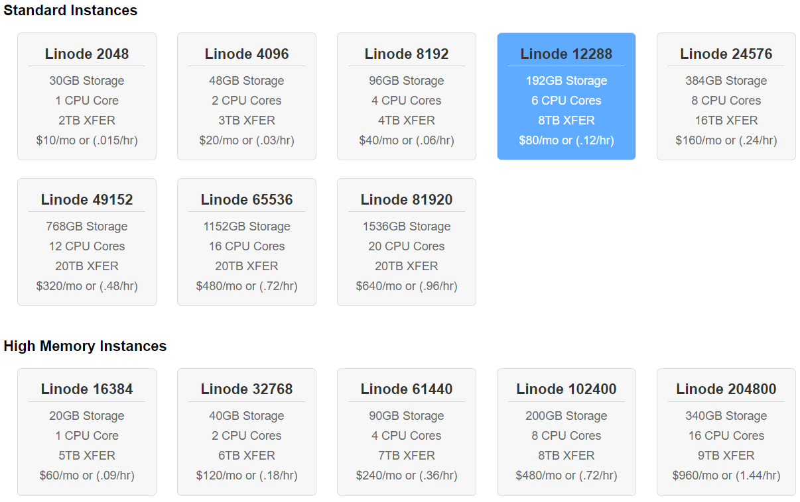
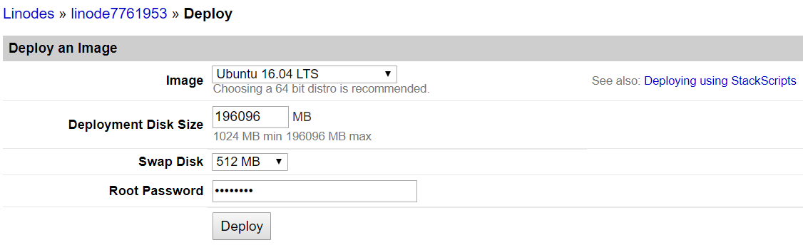
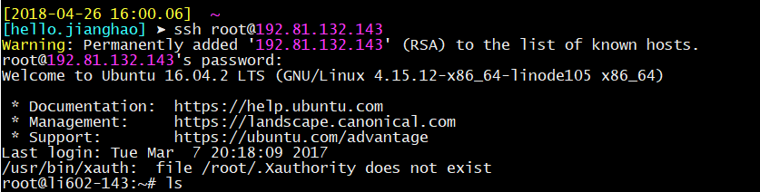

```{r setup, include=FALSE}
knitr::opts_chunk$set(warning=FALSE)
```

# 引言

本练习为[国科大](http://www.ucas.ac.cn/)**地理信息系统应用**课程中的**城市感知与计算**的配套上机实践。

目标通过练习介绍数据科学应用开发工具，进行城市空间信息的获取、分析、应用，发现解决城市发展问题。

练习包括两个部分：

1. Urban Data Science: Tools

> 城市数据科学中的常用工具，处理流程。

2. Urban Data Science: Case Study

> 城市数据科学中的应用案例分析。

# Urban Data Science: Tools

介绍城市数据科学的常见工具平台，并演示如何搭建Linux云平台，安装、介绍、联系基本工具。

## Liunx云服务器
目前国内外服务器平台众多，如国内的[阿里云](https://www.aliyun.com)、[腾讯云](https://cloud.tencent.com/)，国际的[AWS](https://aws.amazon.com/cn/)、[Google Cloud](https://cloud.google.com/)、[Linode](https://www.linode.com)等等。

这里以[`Linode`](https://www.linode.com) 为例（性价比高，稳定快速），介绍如何快速大家Linux 云服务器。

- 打开主页：https://www.linode.com，并注册一个账号；
- 根据应用需求购买一个云服务器：
  
  
- 部署操作系统环境（Deploy an Image）,如入门的Ubuntu 16.04 LTS， 然后开机（Boot）运行
  
  
- 远程运行（Remote Access）：利用SSH Access，如`ssh root@192.81.132.143`, Linux 和 Unix 直接利用`ssh`运行，Windows可以利用PuTTY (下载地址：https://www.chiark.greenend.org.uk/~sgtatham/putty/latest.html ).


## Linux快速入门

Linux 的常见命令, [参考资料](https://blog.csdn.net/ljianhui/article/details/11100625)

1. `cd`: 这是一个非常基本，也是大家经常需要使用的命令，它用于切换当前目录，它的参数是要切换到的目录的路径，可以是绝对路径，也可以是相对路径。如：

```bash
cd /root/Docements # 切换到目录/root/Docements  
cd ./path          # 切换到当前目录下的path目录中，“.”表示当前目录    
cd ../path         # 切换到上层目录中的path目录中，“..”表示上一层目录  
```

2. `ls`: 这是一个非常有用的查看文件与目录的命令，list之意，它的参数非常多，常用的参数如下：

```bash
-l ：列出长数据串，包含文件的属性与权限数据等  
-a ：列出全部的文件，连同隐藏文件（开头为.的文件）一起列出来（常用）  
-d ：仅列出目录本身，而不是列出目录的文件数据  
-h ：将文件容量以较易读的方式（GB，kB等）列出来  
-R ：连同子目录的内容一起列出（递归列出），等于该目录下的所有文件都会显示出来  
```

3. `cp`: 该命令用于复制文件，copy之意，它还可以把多个文件一次性地复制到一个目录下，它的常用参数如下：

```bash
-a ：将文件的特性一起复制  
-p ：连同文件的属性一起复制，而非使用默认方式，与-a相似，常用于备份  
-i ：若目标文件已经存在时，在覆盖时会先询问操作的进行  
-r ：递归持续复制，用于目录的复制行为  
-u ：目标文件与源文件有差异时才会复制  

cp -a file1 file2 #连同文件的所有特性把文件file1复制成文件file2  
cp file1 file2 file3 dir #把文件file1、file2、file3复制到目录dir中 
```

4. `mv`: 该命令用于移动文件、目录或更名，move之意，它的常用参数如下：

```bash
-f ：force强制的意思，如果目标文件已经存在，不会询问而直接覆盖  
-i ：若目标文件已经存在，就会询问是否覆盖  
-u ：若目标文件已经存在，且比目标文件新，才会更新  

mv file1 file2 file3 dir # 把文件file1、file2、file3移动到目录dir中  
mv file1 file2 # 把文件file1重命名为file2  
```

5. `rm`: 该命令用于删除文件或目录，remove之间，它的常用参数如下：

```bash
-f ：就是force的意思，忽略不存在的文件，不会出现警告消息  
-i ：互动模式，在删除前会询问用户是否操作  
-r ：递归删除，最常用于目录删除，它是一个非常危险的参数  

rm -i file # 删除文件file，在删除之前会询问是否进行该操作  
rm -fr dir # 强制删除目录dir中的所有文件  
```

6. `ps`: 该命令用于将某个时间点的进程运行情况选取下来并输出，process之意，它的常用参数如下：

```bash
-A ：所有的进程均显示出来  
-a ：不与terminal有关的所有进程  
-u ：有效用户的相关进程  
-x ：一般与a参数一起使用，可列出较完整的信息  
-l ：较长，较详细地将PID的信息列出 

ps aux # 查看系统所有的进程数据  
ps ax # 查看不与terminal有关的所有进程  
ps -lA # 查看系统所有的进程数据  
ps axjf # 查看连同一部分进程树状态 
```

还可以利用`top`列出系统资源。

7. `tar`: 该命令用于对文件进行打包，默认情况并不会压缩，如果指定了相应的参数，它还会调用相应的压缩程序（如gzip和bzip等）进行压缩和解压。它的常用参数如下：

```bash
-c ：新建打包文件  
-t ：查看打包文件的内容含有哪些文件名  
-x ：解打包或解压缩的功能，可以搭配-C（大写）指定解压的目录，注意-c,-t,-x不能同时出现在同一条命令中  
-j ：通过bzip2的支持进行压缩/解压缩  
-z ：通过gzip的支持进行压缩/解压缩  
-v ：在压缩/解压缩过程中，将正在处理的文件名显示出来  
-f filename ：filename为要处理的文件  
-C dir ：指定压缩/解压缩的目录dir  

压缩：tar -jcv -f filename.tar.bz2 要被处理的文件或目录名称  
查询：tar -jtv -f filename.tar.bz2  
解压：tar -jxv -f filename.tar.bz2 -C 欲解压缩的目录 
```

8. `cat`: 该命令用于查看文本文件的内容，后接要查看的文件名，通常可用管道与more和less一起使用，从而可以一页页地查看数据。例如：

```bash
cat text | less # 查看text文件中的内容  
# 注：这条命令也可以使用less text来代替  
```

9. `vim`: 该命令主要用于文本编辑，它接一个或多个文件名作为参数，如果文件存在就打开，如果文件不存在就以该文件名创建一个文件。vim是一个非常好用的文本编辑器，它里面有很多非常好用的命令。

10. `apt-install`: 安装Ubuntu下面的软件包。

## R 计算平台

参考老师Blog: [Configure Rstudio Server on Ubuntu 16.04](http://jianghao.wang/post/2018-01-23-rstudio-server/)

### Install `ubuntugis` on Ubuntu
> ref: https://github.com/r-spatial/sf

To install the dependencies on Ubuntu, either add ubuntugis-unstable to the package repositories:

```shell
sudo apt-get update
sudo apt-get install software-properties-common python-software-properties
sudo add-apt-repository ppa:ubuntugis/ubuntugis-unstable
sudo apt-get update
sudo apt-get install libudunits2-dev libgdal-dev libgeos-dev libproj-dev 
```
### install `libxml2-dev` and `libcurl4-openssl-dev`

Before install R package `RCurl` and `XML`, first we need to install `libxml2-dev` and `libcurl4-openssl-dev`

```
sudo apt-get install libxml2-dev
sudo apt-get install libcurl4-openssl-dev
```

### install `FreeType`

****************************************************
Error: freetype-config not found.
Please install FreeType with freetype-config script.
If you have not installed FreeType, you can
download the source code from http://freetype.org/

In Debian/Ubuntu-like systems, you can use
  `sudo apt-get install libfreetype6-dev`
to install FreeType

For rpm-based systems, try
  `sudo yum install freetype-devel`
****************************************************

### Install R on Ubuntu 16.04

1. Add R repository

First, we’ve got to add a line to our /etc/apt/sources.list file. This can be accomplished with the following. Note the “xenial” in the line, indicating Ubuntu 16.04. If you have a different version, just change that.

```
sudo echo "deb http://cran.rstudio.com/bin/linux/ubuntu xenial/" | sudo tee -a /etc/apt/sources.list
```

2. Add R to Ubuntu Keyring

```
gpg --keyserver keyserver.ubuntu.com --recv-key E084DAB9
gpg -a --export E084DAB9 | sudo apt-key add -
```

3. Install R-Base

Most Linux users should be familiar with the old…

```
sudo apt-get update
sudo apt-get install r-base r-base-dev
```

### install `R` packages
Run the following code, need ~ 10 min to install all these packages.

```r
options("repos" = c(CRAN = "http://cran.rstudio.com/"))
# ~ 15 mins
install.packages(c("sf", "tidyverse"))
```

### Use `RStudio Server`

1. Install `RStudio Server`

Download RStudio Server v1.1.414
https://www.rstudio.com/products/rstudio/download-server/


```shell
sudo apt-get install gdebi-core
wget https://download2.rstudio.org/rstudio-server-1.1.447-amd64.deb
sudo gdebi rstudio-server-1.1.447-amd64.deb
```

2. Creating RStudio User

It is not advisable to use the root account with RStudio, instead, create a normal user account just for RStudio. The account can be named anything, and the account password will be the one to use in the web interface.

```
sudo adduser rstudio
```

RStudio will use the user's home directory as it's default workspace.

3. Using R Studio Server

By default RStudio Server runs on port `8787` and accepts connections from all remote clients. After installation you should therefore be able to navigate a web browser to the following address to access the server:

For example

```
http://<server-ip>:8787
http://192.81.132.143:8787/auth-sign-in
```