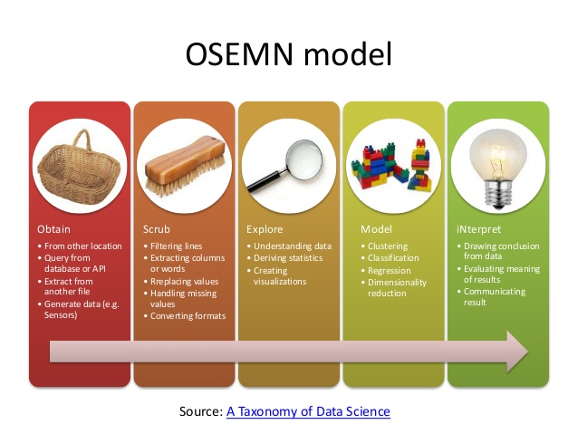
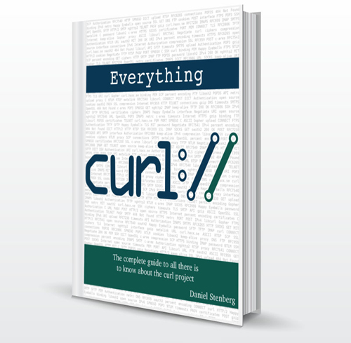
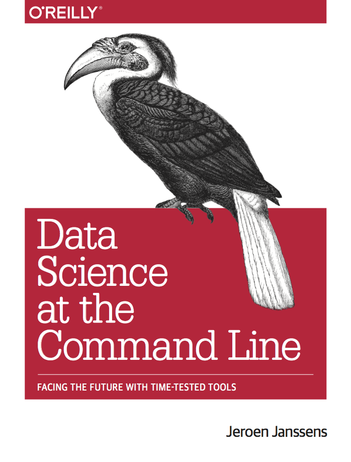

# 引言
本练习介绍如何利用命令行工具，完成基本的数据分析。

Mason & Winggins (2010) 定义数据科学的5个步骤：

1. 数据获取
2. 数据清洗
3. 数据探索
4. 数据建模
5. 数据解释

这5个步骤一起构成了OSEMN（发音同awesome）模型。

本练习将**以空气质量数据获取分析**为例，介绍命令行工具的基本使用方法。




## 数据获取

入门工具`cURL`（Uniform Resource Locator ) , `wget` , 中文详细文档可以参考这里：http://man.linuxde.net/curl



http://aqicn.org/map/china

```shell
curl 'https://api.waqi.info/mapq/bounds/?bounds=7.36246686553575,67.67578125000001,57.040729838360875,139.39453125000003&inc=placeholders&k=_2Y2EzUR9mM1wcMyNDSyJWXmldWkU/LRVTFlYzLw==&_=1524745613939' -H 'origin: http://aqicn.org' -H 'accept-encoding: gzip, deflate, br' -H 'accept-language: zh-CN,zh;q=0.9,en;q=0.8' -H 'user-agent: Mozilla/5.0 (Windows NT 10.0; Win64; x64) AppleWebKit/537.36 (KHTML, like Gecko) Chrome/66.0.3359.117 Safari/537.36' -H 'accept: */*' -H 'referer: http://aqicn.org/map/China' -H 'authority: api.waqi.info' --compressed | jq '.'
```

## 数据清洗

`json2csv`: https://www.npmjs.com/package/json2csv

Install `json2csv`

```shell
sudo apt install npm
npm install -g json2csv
ln -s /usr/bin/nodejs /usr/bin/node
apt install python3-csvkit
```

将json转换为csv文件

```shell
json2csv -i aqi.json -o aqi.csv
head -n 10 aqi.csv | csvlook
```

## 数据探索

`csvstat aqi.csv` 

```

root@li602-143:~# csvstat aqi.csv
  1. lat
        <class 'float'>
        Nulls: False
        Min: 7.8816363400512
        Max: 50.4269
        Sum: 15606.246867772883
        Mean: 31.527771450046227
        Median: 32.006667
        Standard Deviation: 8.136852362126739
        Unique values: 495
  2. lon
        <class 'float'>
        Nulls: False
        Min: 72.88261
        Max: 139.2201926
        Sum: 55152.58896821913
        Mean: 111.41937165296794
        Median: 113.16653
        Standard Deviation: 14.165262715874178
        Unique values: 495
  3. city
        <class 'str'>
        Nulls: False
        Unique values: 495
        Max length: 121
  4. idx
        <class 'int'>
        Nulls: True
        Min: 399
        Max: 4768
        Sum: 743467
        Mean: 1511.111788617886
        Median: 1419.0
        Standard Deviation: 718.8586013416109
        Unique values: 422
        5 most frequent values:
                1480:   4
                1482:   4
                1475:   3
                1294:   3
                1442:   3
  5. stamp
        <class 'int'>
        Nulls: True
        Min: 1452070800
        Max: 1524747600
        Sum: 747921879645
        Mean: 1523262484.0020366
        Median: 1524744000
        Standard Deviation: 7135539.769468024
        Unique values: 32
        5 most frequent values:
                1524744000:     257
                1524740400:     117
                1524736800:     35
                1524742200:     14
                1516147200:     10
  6. pol
        <class 'str'>
        Nulls: True
        Values: pm25, pm10
  7. x
        <class 'str'>
        Nulls: False
        Unique values: 495
        Max length: 13
  8. aqi
        <class 'str'>
        Nulls: False
        Unique values: 125
        5 most frequent values:
                -:      44
                95:     17
                72:     13
                76:     12
                63:     12
        Max length: 11
  9. tz
        <class 'str'>
        Nulls: True
        Unique values: 7
        5 most frequent values:
                +0800:  374
                +0900:  63
                +0530:  27
                +0700:  22
                +0545:  4
        Max length: 6
 10. utime
        <class 'datetime.datetime'>
        Nulls: True
        Min: 2016-01-06 16:00:00
        Max: 2018-04-26 21:00:00
        Unique values: 29
        5 most frequent values:
                2018-04-26 20:00:00:    271
                2018-04-26 19:00:00:    77
                2018-04-26 18:00:00:    37
                2018-04-26 21:00:00:    26
                2018-04-26 17:00:00:    24
 11. img
        <class 'str'>
        Nulls: True
        Unique values: 492
        Max length: 141

Row count: 495
```

## 数据建模

命令行的数据建模较弱，建议采用其他分析语言来进行处理。

## 总结

更多内容，可参考本书：https://www.datascienceatthecommandline.com/


