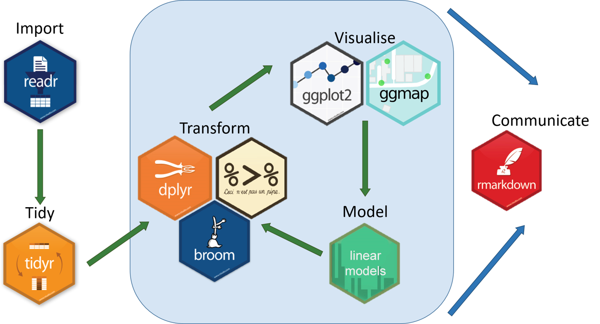

```{r setup, include=FALSE}
knitr::opts_chunk$set(warning=FALSE)
```

# 引言
介绍如何利用R进行空间数据分析。



同样地，本练习将**以空气质量数据获取分析**为例，介绍R在空间数据分析中的应用。

# 空气污染制图

初始化
```{r}
library(tidyverse)
library(sf)
library(ggmap)
library(automap)
```


## 读取和预览数据

```{r}
df <- read_csv("aqi.csv")
head(df)
df$aqi <- as.numeric(df$aqi)
hist(df$aqi, breaks = 30)
ggplot(df, aes(x = aqi)) + 
  geom_histogram() +
  geom_density()
```


## 清洗数据

利用`dplyr`， `tidyr`来进行数据的清晰，并学习使用管道 %>%

```{r}
df <- df %>% 
  filter(!is.na(aqi)) %>%
  select(-img) %>%
  select(lon, lat, aqi) %>%
  mutate(aqi = as.numeric(aqi))

ggplot(df, aes(x = lon, y = lat)) +
    geom_point(aes(colour = aqi))

library(RColorBrewer)
display.brewer.all()
```

## 空间可视化

```{r}
sp <- df
coordinates(sp) <- ~ lon + lat
proj4string(sp) <- CRS("+proj=longlat +ellps=WGS84 +datum=WGS84 +no_defs")
str(sp)
spplot(sp)
sf <- st_as_sf(sp)
plot(sf, graticule = TRUE, axes = TRUE)

terrain <-
  get_map(
    location = c(lon = 105, lat = 39),
    zoom = 4,
    maptype = "terrain",
    source = "google",
    messaging = FALSE
  )

colours = c( "#009966", "#ffde33", "#ff9933", "#cc0033", "#660099", "#7e0023")
ggmap(terrain) + 
  geom_point(data = df, aes(x = lon, y = lat, colour = aqi)) +
  scale_colour_gradientn(colours = colours)

library(leaflet)
pal <- colorQuantile("YlOrRd", NULL, n=5)
leaflet(df) %>% addTiles()%>% 
  addCircleMarkers(~lon, ~lat , popup=df$aqi,
                   radius = log2(df$aqi),
                   stroke = FALSE, fillOpacity = 0.8,
                   color= ~pal(df$aqi)) 
```

## 空间插值

```{r}
library(raster)
library(rasterVis)
library(rgdal)

r <- raster("pop_10km.tif")
r
plot(r)
levelplot(r %>% log())

grid <- as(r, "SpatialGridDataFrame")
obs <- spTransform(x = sp, CRSobj = grid@proj4string)

library(automap)
pm25 <- autoKrige(aqi ~ 1, obs, grid, 
                  remove_duplicates = T, debug.level = 0)
pm25.cv <- autoKrige.cv(aqi ~ 1, obs, nfold = 10)

ggplot(as.data.frame(pm25.cv$krige.cv_output), aes(x = var1.pred, y = observed)) + 
  geom_point() + 
  geom_smooth(method = lm) +
  geom_abline(intercept = 0, slope = 1, colour = "red") +
  xlim(0, 300) +
  ylim(0, 300)

lm(pm25.cv$krige.cv_output$var1.pred ~ pm25.cv$krige.cv_output$observed - 1) %>% summary()

plot(pm25)
```

